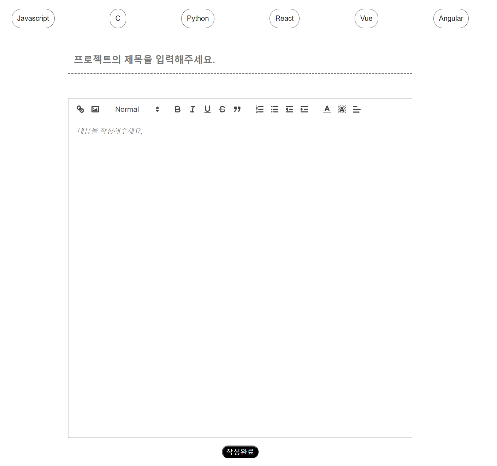

# [NBC] Code Feed : 8조 조랭이떡
2024.02.07 ~ 2024.02.14

## 1. Git & GitHub

## 2. 기능 구상

### Detail Page

  - [x] 홈에서 클릭한 게시된 이미지에 따라 상세 정보를 얻을 수 있도록 만들었습니다.
  - [x] 상세 페이지에서 볼 수 있는 것인 유저가 입력한 제목, 사진, 내용입니다.
  - [x] 자신이 만든 게시물은 삭제가 가능하며, 삭제버튼을 확인할 수 있습니다.
  - [x] 마이페이지의 Posting 버튼을 통해 게시물을 동록할 수 있습니다.
  - [x] 삭제하기 버튼을 누른다면 "정말삭제하시겠습니까?" 라는 글이 창에 뜨고, 유저는 취소와 확인 버튼을 통해 게시물 처리를 할 수 있습니다.
   
  
**state 정보**
1. const [contents, setContents] = useState([])와 const [checkUid, setCheckUid] = useState(null)를 이용하였으며,
2. contents에는 유저가 저장한 제목, 사진, 내용이 저장되어 있습니다.
3. checkUid는 인증 정보가 저장되어 있습니다.

**브랜치**
브랜치는 detail과 detail2를 활용하였습니다.

### MyPage

**기능구현**
마이페이지는 사용자의 정보를 받아와 이름, 가입한 이메일을 띄웁니다.
프로필 이미지는 기본 이미지로 바탕이 되어있고, 사용자가 Edit Profile 버튼을 누르면 프로필을 수정 할 수 있습니다.
 
상단 탭에는 홈버튼과 게시글을 올릴 수 있는 포스팅 탭이 존재합니다.
또한, 검색창도 배치되어 사용자가 원하는 게시글을 쉽게 찾아볼 수 있습니다.
검색기능은 오로지 Enter 키를 눌렀을 때만 검색이 되도록 구현하여 깔끔한 웹을 만들었습니다.
 
하단에는 사용자가 작성한 게시글을 띄웁니다.
대표 이미지와 제목을 띄우고, 게시글 이미지를 클릭했을 시에는 게시글 상세페이지로 넘어갑니다.

포스팅 페이지에서 글을 테스트로 작성해보았습니다.

마이페이지에는 작성한 글이 새롭게 추가되어 있는 모습을 볼 수 있습니다.
또한, 최신순으로 정렬됩니다.

**브랜치**
MyPage 브랜치에서 작업했습니다.

### Home
> 홈화면은 파이어베이스에서 유저 정보랑 게시글 정보를 가져와서 화면에 보여주는 식으로 구현했습니다.
> 로그인을 하지 않을 시 로그인 문구가 자리잡아 있고 로그인을 하면 그자리에 유저 정보가 자리잡아 있습니다.
> 로그인 전 화면입니다.
> 
> 로그인 후 화면입니다.
> 
> 유저 정보를 누르면 마이페이지로 이동됩니다.

### Search Page
search page는 검색(input)에서 엔터를 누르면 이동합니다.

> 검색 페이지 화면입니다.
> 
> 여기서도 새로고침을 할시 파이어베이스에서 데이터를 가져와 게시글을 세팅하고 검색에 맞는 게시글을 렌더링 합니다.
> 그리고 검색어를 바로 적용하여 거기에 맞는 제목이나 언어를 포함한 게시글을 보여줍니다.

### Profile Update
> 프로필 수정기능화면입니다.
> 
> 프로필 수정화면에서는 프로필 이미지와 프로필 이름을 변경할 수 있고 적용 즉시 렌더링 되어 화면에 적용 됩니다.
> Image Upload를 누룬 후 사진을 업로드 하면 이미지 미리보기가 되고 Image Change를 누르면 프로필 이미지가 변경 됩니다.
> 이름 변경의 경우 변경 할 이름을 input에 적고 이름을 Name Change를 누르게 되면 이름을 변경하게 됩니다.

### WriteDetail Page

#### 1. 페이지 소개
React Quill 에디터를 이용하여 게시글을 편집할 수 있습니다.
Quill 에디터의 툴바를 선택하여 글의 굵기, 기울기, 취소선 등을 설정 할 수 있습니다.
또한 이미지 업로드 기능과 링크 첨부 기능이 있어서 글을 작성하기 매우 편리합니다.
상단의 언어버튼을 클릭하면 프로젝트를 작성한 언어를 지정하여 메인페이지에서 언어별 필터링 시, 해당 게시글이 필터링 될 수 있습니다.
!

#### 2. 컴포넌트 분리

##### 2.1. LanguageFilter
초기에는 Home 페이지에서 언어별 필터링할 때 사용하는 FilterCheck 컴포넌트를 import해서 사용했습니다.
하지만 기능이 추가됨에 따라서 FilterCheck가 다른 기능을 하게 되었고,
기존에 FilterCheck를 사용하던 방식과 동일하게 Language 컴포넌트를 만들었습니다.
useState를 이용하여 사용자가 클릭한 언어의 정보를 담고, props를 통해 LanguageFilter에 넘겨주는 방식을 사용했습니다.

##### 2.2. QuillComponent
리액트 퀼 에디터를 원하는대로 사용할 수 있게 커스텀한 정보를 담고 있는 컴포넌트입니다.
이 컴포넌트의 toolbarOptions에서 툴바의 기능 중 어떤 기능을 사용할지 결정합니다.
또한 이미지 삽입과 링크 삽입을 할 수 있는 모듈을 이 컴포넌트에서 주관합니다.

##### 2.3. ImageHandler
툴바의 이미지 업로드 버튼을 누르면 PC에 있는 이미지를 파이어베이스의 스토리지에 업로드 하는 컴포넌트입니다.
이미지가 업로드 되는 동시에 스토리지에 업로드된 이미지의 URL을 전달받아 퀼에디터에도 이미지를 출력합니다.

#### 3. 기능
1. ReactQuill 에디터를 사용하여 게시글 작성
2. 작성된 내용과 이미지 파이어베이스에 업로드
3. 언어별 필터 선택하는 기능
4. 에디터에서 편집된 모양이 유지된 채로 업로드

## 3. DataBase

Firebase를 활용하였습니다.

## 4. 기타

- CRA 대신 Vite를 사용하였습니다.
- useState를 사용하여 만들었습니다.
- styled-components 를 사용하여 css를 디자인하였습니다.
- reset.css 코드를 적용하였습니다.
- react-router-dom 을 이용해 홈화면과 상세 페이지에서 홈으로 이동이 가능하도록 만들었습니다.

## 5. contributor
- 금상호
- 이지은
- 오소향
- 오소향
- 정해준
